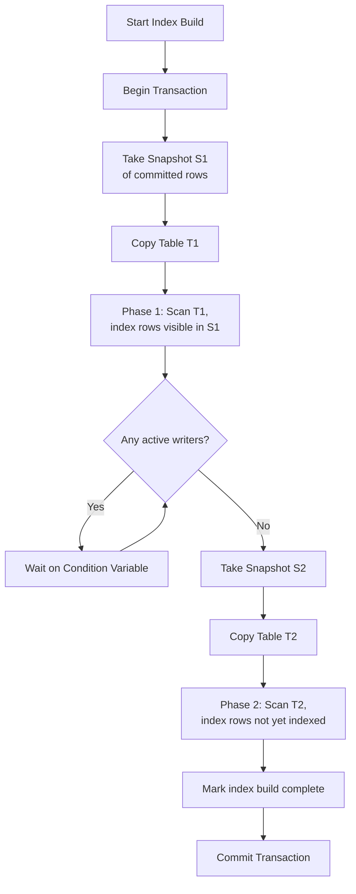

# concur-idx

A minimal Go simulation of **PostgreSQL's `CREATE INDEX CONCURRENTLY`** mechanism — demonstrating how indexes can be built without blocking concurrent writes.

## The Problem

In PostgreSQL, the standard `CREATE INDEX` command takes an `ACCESS EXCLUSIVE` lock on the table, which **blocks all concurrent inserts, updates, and deletes** for the duration of the index build. On large tables this can mean minutes or hours of downtime for writes.

This simulation demonstrates how `CREATE INDEX CONCURRENTLY` solves that: it builds the index in **two-phase scan** while allowing concurrent transactions to proceed normally.

## What This Project Does

This Go program simulates a simplified database engine where:

1. A **table** (slice of `User` rows) holds data.
2. A **concurrent index builder** starts building an index on `User.Name`.
3. While the index is being built, a **concurrent writer** inserts new rows.
4. The builder uses **snapshot isolation** and **two scans** to ensure the final index includes all rows that were visible when the index build completed — without ever blocking the writer.

## Key Components

| File | Responsibility |
|------|---------------|
| `types.go`| Core data types — `User` (table row), `Transaction`, `Snapshot`, and global shared state (mutex, condition variable, index map, pending writes). |
| `transaction.go`| Transaction lifecycle — `beginTransaction()` and `commitTransaction()`. Commits broadcast on a condition variable to wake the index builder. |
| `table.go` | Table operations — `getCurrentSnapShot()` (returns only committed transactions) and `insertUser()` (appends under a lock, queues into `pending` if index build is in progress). |
| `index.go` | The concurrent index builder — **two-phase scan** algorithm using snapshot isolation. |
| `main.go`  | Entry point — seeds the table, launches the index builder and a concurrent writer, then prints the final index. |

## Algorithm Flow



### Phase details

1. **Snapshot & first scan** — The builder takes a snapshot of all committed rows and scans them, inserting entries into the index. This is the long-running part (simulated with `time.Sleep`).
2. **Wait for writers** — The builder waits (via condition variable) until every writer transaction that started during Phase 1 has committed.
3. **Second scan (synchronize)** — The builder takes a fresh snapshot and indexes any rows that were committed during Phase 1 but were not yet visible in the first snapshot. Because all writers from Phase 1 are done, no row is missed.

Throughout both phases, concurrent writes are **never blocked** — they proceed in parallel with the index build.

## How to Run

```bash
go run .
```

The output traces the index builder's progress alongside concurrent inserts, and prints the final index mapping.

## PostgreSQL Documentation

For the real-world implementation this simulation is based on:

- [PostgreSQL: CREATE INDEX CONCURRENTLY](https://www.postgresql.org/docs/current/sql-createindex.html#SQL-CREATEINDEX-CONCURRENTLY)
- [PostgreSQL: Index Maintenance and Locking](https://www.postgresql.org/docs/current/sql-createindex.html#SQL-CREATEINDEX-CONCURRENTLY)

The key idea (from the PostgreSQL docs):

> "PostgreSQL supports building indexes without locking out writes. This approach is invoked by specifying `CONCURRENTLY`. When this option is used, PostgreSQL must perform two scans of the table, and in addition it must wait for all existing transactions that could modify the table to terminate."
